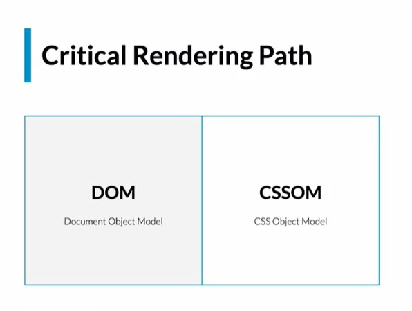
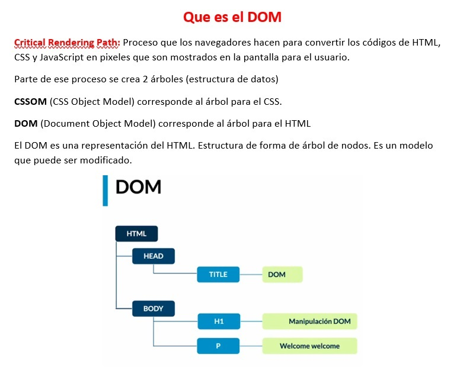

# DOM   

* DOM
* OBJETO WINDOW
* OBJETO DOCUMENT
* Ideas/conceptos claves
* Web APIs modernas
* Leer Nodos

## DOM
¿Qué nos permite hacer JS con el
D.O.M.?

● Modificar elementos, atributos y estilos de una
página.
● Borrar cualquier elemento y atributo.
● Agregar nuevos elementos o atributos.
● Reaccionar a todos los eventos HTML de la ppágina.
● Crear nuevos eventos HTML en la página.

## OBJETO WINDOW
El objeto window es lo primero que se carga en el
navegador.
Representa la ventana donde estamos navegando y nos
da la interfaz para operar con el navegador.
El objeto window tiene propiedades como lenght,
innerWidth, etc

## OBJETO DOCUMENT
Representa al HTML y nos va a dar una interfaz, un
conjunto de atributos y de métodos para poder
efectivamente leer lo que tenemos en el HTML y si
quisiéramos modificarlo.
El document es cargado dentro del objeto window y tiene
propiedades como title, url, cookie, etc. 

## Ideas/conceptos claves

1- Critical Rendering Path Es el proceso que se encarga de convertir en pixeles el HTML, CSS y JS

2- El DOM arbol para el HTML que contiene toda nuestra estructura HTML
Es una representación del HTML
Estructura en forma de árbol de nodos
Es un modelo que puede ser modificado

3 -El CSSOM es el arbol para el CSS
..........
Todos los navegadores los utilizan para trabajar en un sitio web
Todo comienza con el proceso llamado “Critical Rendering Path”
Se puede dividir en 5 partes
A lo largo del proceso el navegador crea dos arboles

RESUMEN: Para mostrar un sitio hay un proceso llamado Critical Render Path en él se crean dos árboles el DOM y el CSSOM. El Dom sera aquel que se encargará de tener todo nuestro contenido en una representación de arbol que contendrá nodos

🌳 DOM: Árbol para HTML -> Permite acceder y modificar las etiquetas: head>, p>, footer>, etc.

🎨 CSSOM: Árbol para CSS -> Permite acceder y modificar estilos CSS.

💻 BOM: Árbol para navegador. Permite acceder y modificar las propiedades de las ventanas del propio navegador.

🔩 Critical Rendering Path (CRP): Ruta de instrucciones que el navegador ejecuta para convertir HTML, CSS y JavaScript en píxeles.

## Web APIs modernas
Una API es todo lo que sirva para comunicar fácilmente un pedazo de software con otro.
Cuando combinamos el DOM+JS = WEB API.

Un ejemplo para entender el back, front y apis. 

El Backend es la cocina
El Frontend serían las mesas, la decoración de ellas
Las APIS serían los meseros

Una API no es nada mas que un puente. Nos permite conectar el DOM con JS para que podamos manipularlo, agregar o modificar los nodos a nuestro antojo.

Las Interfaces de Programacion de Aplicaciones (APIs por sus siglas en inglés) son construcciones disponibles en los lenguajes de programación que permiten a los desarrolladores crear funcionalidades complejas de una manera simple. Estas abstraen el código más complejo para proveer una sintaxis más fácil de usar en su lugar.

APIs en JavaScript del lado cliente
JavaScript del lado cliente, particularmente, tiene muchas APIs disponibles — estas no son parte del lenguaje en sí, sino que están construidas sobre el núcleo de este lenguaje de programación, proporcionándote superpoderes adicionales para usar en tu código. Por lo general, se dividen en dos categorías:

Las APIs de navegador están integradas en tu navegador web y pueden exponer datos del navegador y del entorno informático circundante y hacer cosas complejas y útiles con él. Por ejemplo, la API de Geolocalización.
Las APIs de terceros no están incluídas por defecto en el navegador, y por lo general es necesario obtener el código e información desde algún lugar de la Web. Por ejemplo, la API de Twitter permite hacer cosas como mostrar tus últimos tweets en un sitio web. Proporciona un conjunto especial de construcciones que puedes usar para consultar el servicio de Twitter y devolver información específica.

API ⇒ Es un puente 🌉

Una web API nos permite conectar el JS con el DOM para poder manejarlo (leer y modificar)
Actualmente existen más de 70 web APIs, Dom es solo una de ellas

ya existen diferentes propósitos
Animaciones
Drag & Drop
Transmisión de video con web RTC
Manejo de videojuegos como ser con WebGL
Incluso pagos sin necesidad de otro servicio
Debemos hacernos dos preguntas al momento de usar las APIs

**¿Como lo uso?**
MDN contiene bastante información acerca de las webs APIs
Developer mozilla
**¿Puedo usarlo?** 
CanIuse.com
No todas las webs API’s estarán soportadas por todos los navegadores entonces podemos usar caniuse
Chrome tiene bastante compatibilidad con nuevas APIs

RESUMEN: Para manejar el DOM mediante JS se debe tomar en cuenta que estaremos usando una web API, cada vez que usemos una de ellas debemos tomar en cuenta dos preguntas de cómo usarlo y si se puede implementar en todos los navegadores o usuarios que deseemos llegar
más info..

##  Leer nodos

Los objetos NodeList son colecciones de nodos como los devueltos por propiedades como Node.childNodes y el método document.querySelectorAll () Aunque NodeList no es un Array, es posible iterar sobre él utilizando forEach(). También puede convertirse a un Array usando Array.from

Básicamente tenemos 4 formas de leer nodos con JS:

parent.getElementById(‘id’) => nos permite obtener un elemento a través de su id.
.
parent.getElementsByClassName(‘class’) => obtiene un array con todos los elementos hijos que tengan esa clase, ojo “getElementByClassName” no existe, es decir no podremos obtener solo 1 elemento con esa clase.
.
parent.getElementsByTagName(‘div’) => con este método obtenemos una lista o “array list” con todos los elementos que tengan esa etiqueta, ejemplo todos los divs. Al igual que con el método anterior no hay posibilidad de usarlo en singular, siempre tendremos que usar getElements
.

parent.querySelector() => nos permite buscar de 3 formas, con id, clase o tagName. A diferencia de los 2 anteriores este nos devuelve 1 solo elemento, el primero que contenga el valor que se le paso. Id => (’#id’), class => (’.class’), tagName (‘div’)
.
parent.querySelectorAll() => este método retorna una array list con todos los elementos que tengan ese selector (id, class o tagName)
.

Casi siempre el elemento “padre o parent” es document. ya que estamos haciendo referencia a todo el DOM, todo el documento y esto en ciertos casos nos permite evitar errores.
ejemplo = const button = document.querySelector(’#button)

RESUMEN: Para poder leer nodos tenemos diferentes métodos brindados por el navegador, entre los mas destacados estan los de querySelector y querySelectorAll que nos permiten especificar lo que deseamos traer mediante una cadena de texto. Ademas que si nos devuelven una lista esta sera una nodeList

