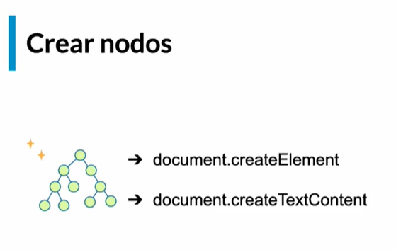
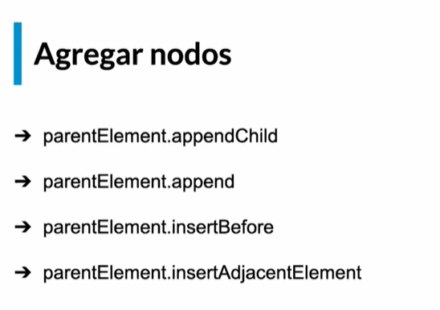
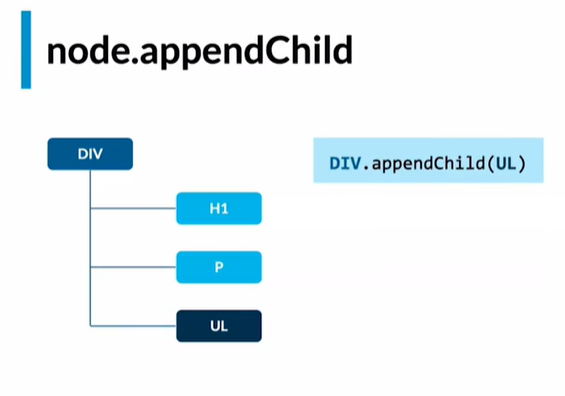
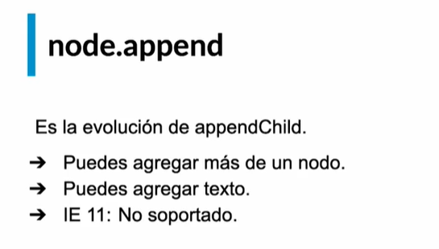
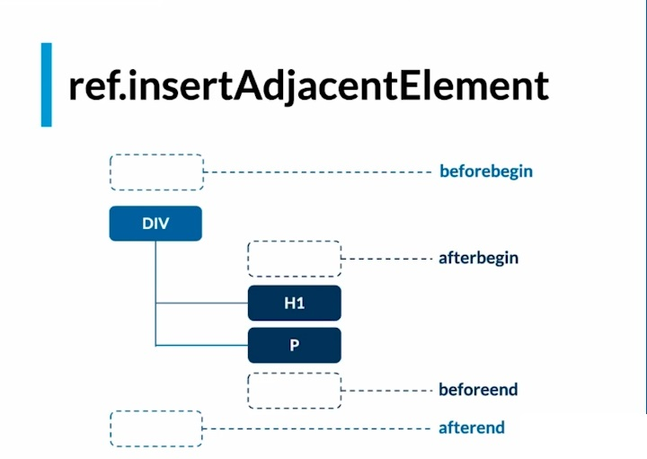

# DOM   

* Crear NODOS
* Agregar NODOS
* parentElement.append():
* Otras formas de agregar

## Crear NODOS
Al decir “crear nodos” nos referimos a crear elementos dentro de nuestro DOM. Para ello podemos hacer uso de:

createElement: Para crear una etiqueta HTML:
// Solo se ha creado, aún no se agrega al DOM
const etiquetaH1 = document.createElement("h1")

createTextNode: Para crear un texto:
// Solo se ha creado, aún no se agrega al DOM
const texto = document.createTextNode("¡Hola, Mundo!")

## Agregar NODOS
Como solo creamos, necesitamos formas de agregarlos al DOM, para ello, JavaScript nos provee de estas formas:

parentElement.appendChild(): Agrega un hijo al final algún elemento

/ Obtengo el elemento padre
const parentElement = document.querySelector("selector")
// Creo el nodo a insertar
const h3 = document.createElement("h3")
// Creo el texto del nodo
const texto = document.createTextNode("Hola!")
// Inserto el texto al nodo
h3.appendChild(h3)
// Inserto el nodo al padre
parentElement.appendChild(h3)

Ejemplo Grafico:
parentElement.appendChild(): Agrega un hijo al final de algún elemento

## parentElement.append()

parentElement.append(): Es la evolución de appendChild, podemos agregar más de un nodo, puedes agregar texto y… no es soportado por Internet Explorer ¬¬!
.
Un polyfill es una adaptación del código para dar soporte a navegadores que no lo soportan, aquí está el polyfill de append:
https://developer.mozilla.org/es/docs/Web/API/ParentNode/append#polyfill 

Guía para que podamos ir practicando:

‘beforeBegin’: Antes del elementoObjetivo.
‘afterBegin’: Dentro del elementoObjetivo, antes de su primer hijo.
‘beforeEnd’: Dentro del elementoObjetivo, después de su último hijo.
‘afterEnd’: Después del elementoObjetivo.

// Obtengo el elemento padre
const parentElement = document.querySelector("selector")
// Agrego al elemento padre
parentElement.append("agrego un texto", document.createElement("div"))

parentElement.insertBefore(): Inserta nodos antes del elemento que le pasemos como referencia, este nodo de referencia tiene que ser un hijo DIRECTO del padre

// Obtengo el elemento padre
const parentElement = document.querySelector("selector")
// Creo un elemento
const titulo = document.createElement("h1")
// Obtengo la referencia del elemento del que quiero insertar antes:
const referencia = document.querySelector("selector")
// ¡Lo insertamos!
parentElement.insertBefore(titulo, referencia)

parentElement.insertAdjacentElement(): Inserta nodos según las opciones que le pasemos:

beforebegin: Lo inserta antes del nodo
afterbegin: Lo inserta despues del nodo
beforeend: Lo inserta antes de donde finaliza el nodo
afterend: Lo inserta después de donde finaliza el nodo

// Obtengo el elemento padre
const parentElement = document.querySelector("selector")
// Creo un elemento
const nodo = document.createElement("span")
parentElement.insertAdjacentElement("beforebegin", nodo)

# # Otras formas de agregar

Los ataques XSS son un tipo de inyección en la cual un atacante logra ejecutar código en los navegadores de los usuarios que acceden a un sitio web legítimo

Existen otras formas de leer y agregar nodos que son muchas convenientes usando cadenas de texto

node.outerHTML (leer)
Nos dejar leer el HTML como una cadena del nodo seleccionado

node.innerHTML (escribir)
Nos deja modificar el contenido del nodo

La desventaja es que convierte el texto en HTML pudiendo crear inyecciones de XSS

Debido a que convierte todo el texto en HTML, habiendo la posibilidad de que se pueda inyectar códigos de terceros

Si es que fuera muy necesario usar estos métodos y el usuario necesitara ingresar los datos, se debe hacer si o si un proceso de sanitize (Limpieza)

RESUMEN: Existe otras formas de leer y escribir el HTML, pero tienen un riesgo de ataques XSS, no es mala siempre y cuando se tenga un cuidado con las posibilidades del usuario.

Considera no usar InnerHTML cuando el texto a renderizar proviene del usuario ejemplos etiquetas INPUTS
