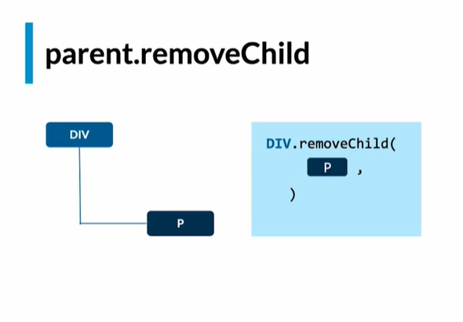
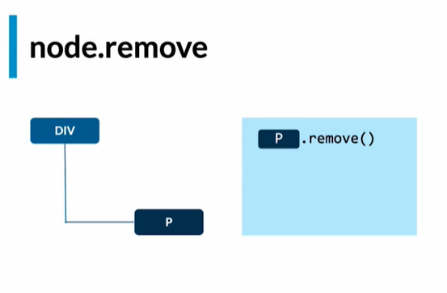

# DOM   

* Eliminar Nodos
* Operaciones En Lote

## Eliminar Nodos

Existen 3 formas de eliminar nodos en el DOM
1)Remove Child

Podemos eliminar un nodo según a un método que proviene del padre y pasamos la referencia a eliminar

padre.removeChild(nodoAEliminar)

2)Remove

Es la evolución de remove child
No esta soportado en internet explorer
nodoAEliminar.remove()

3)Replace Child

Nos permite remplazar un nodo
padre.replaceChild(nuevoNodo, aRemplazar)

<!-- Ejemplos -->

/* 1) */
/* parentElement.removeChild(): */

/* Selecciono el elemento que quiero eliminar */
const nodoAEliminar = document.querySelector("selector") 
// Selecciono a su padre directo (el que está directamente arriba)
const parentElement = nodoAEliminar.parentElement
// Lo elimino
parentElement.removeChild(nodoAEliminar)

Ejemplo .removeChild(): Elimino Nodo P hijo de Div

/* 2)
document.remove(): Es la evolución de removeChild Y… tampoco es soportado por Internet Explorer ¬¬!
.
No importa, aquí está el polyfill:D
https://developer.mozilla.org/es/docs/Web/API/ChildNode/remove#polyfill

// Selecciono el elemento que quiero eliminar
const nodoAEliminar = document.querySelector("selector")

// Lo elimino uwu
nodoAEliminar.remove() */ (no necesito padres ni containers.. nada. solo el nodeo a eliminar)

Ejemplo .remove(): Elimino Nodo P 

/* 3) */
/* document.replaceChild(): Reemplaza un nodo (en pocas palabras lo elimina y mete otro) */
// Selecciono un padre
const padre = document.querySelector("selector")

// Selecciono el elemento al que voy a reemplazar
const toReplace = document.querySelector("selector")

// Creo el nodo por el cual lo voy a reemplazar
const node = document.createElement("h1")
// Le pongo un texto
node.textContent = "Un texto cualquiera"

// Lo reemplazo >:D!!!
parent.replaceChild(node, toReplace)

RESUMEN: Podemos eliminar nodos con diferentes métodos que nos provee el DOM como ser removeChild, el cual necesita la referencia del padre a eliminar y del nodo que se eliminara, remove el cual se encarga de eliminar el nodo solo con la referencia deseada a borrar y finalmente replaceChild que nos ayuda remplazar un elemento con las referencias del padre, el nuevo nodo y el elemento a remplazar

## Operaciones En Lote
Realizar mutaciones en el DOM tiene un costo

Cuando usamos frameworks y librerias lo que más cuesta en estas librerías es estar haciendo operaciones en el DOM

Entre menos operaciones realicemos en el DOM especialmente escribir y eliminar cosas más rápidas sera el website

<h3>Ejemplo: Escribir 100 inputs</h3>

 No optimo (Forma NO óptima: (modificamos el DOM 100 veces))

for (let i = 0; i<100; i++){
    const node = document.createElement('input')
    document.body.appendChild(node)
}

Optimo (Mejor forma: (modificamos el DOM 1 vez))
const nodos = []
for (let i = 0; i<100; i++){
    const node = document.createElement('input')
    nodos.push(node)
}
document.body.append(...nodos)

