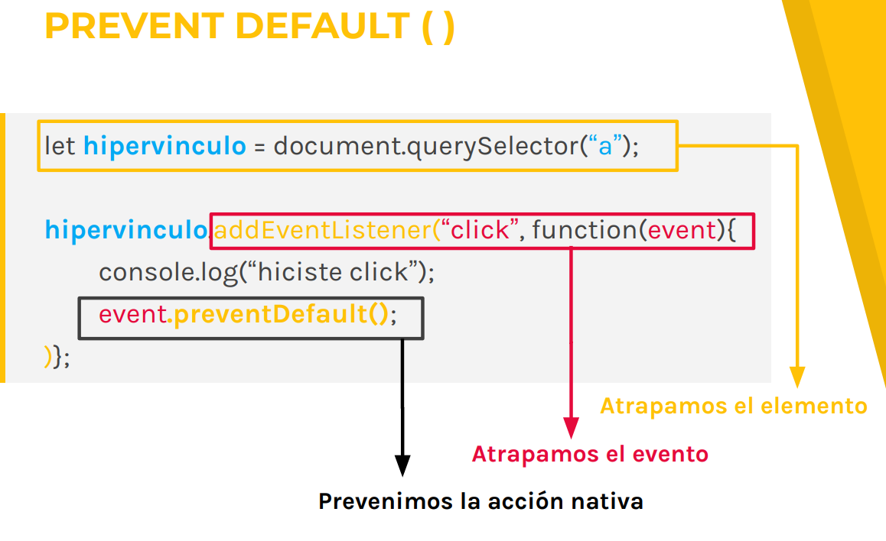

# DOM   

* MODIFICANDO ESTILOS
* MODIFICANDO CLASES
* EVENTOS
* EVENTOS DE MOUSE
* EVENTOS DE TECLADO

## MODIFICANDO ESTILOS
Además de agregar y modificar
elementos HTML, con los
selectores también podemos
modificar los estilos de un
elemento HTML.

PROPIEDAD STYLE
Nos permite leer y sobreescribir las reglas CSS que se
aplican sobre un elemento que hayamos seleccionado.

let titulo = document.querySelector(“.title”);
titulo.style.color = “cyan”;
titulo.style.textAlign = “center”;
titulo.style.fontSize = “12px”;
titulo.style.backgroundColor = “#dddddd”;

Nótese que las reglas CSS que llevaban guiones
como font-size, en Javascript se escriben en
camelCase es decir fontSize.

## MODIFICANDO CLASES
Javascript nos da una propiedad
y varios métodos que nos
permiten hacer diversas acciones
con el atributo class de un
elemento

classList.add( )
Nos permite agregar al elemento que tengamos
seleccionado, una clase nueva.
let cita = document.querySelector(“.cita”);
cita.classList.add(“italicas”);

Antes

el
velóz murciélago comía
feliz cardillo y
kiwi

Despues

el velóz
murciélago comía feliz
cardillo y kiwi

classList.remove( )
Nos permite quitarle una clase existente al elemento que
tengamos seleccionado.
let cita = document.querySelector(“.cita”);
cita.classList.remove(“cita”);
Antes

el velóz
murciélago comía feliz
cardillo y kiwi

Despues

el
velóz murciélago comía
feliz cardillo y
kiwi

classList.toggle( )
Revisa si existe una clase en el elemento seleccionado,
de ser así la remueve, de lo contrario, si la clase no
existe, la agrega.
Antes

el
velóz murciélago comía
feliz cardillo y
kiwi

Despues
let cita = document.querySelector(“p”);
cita.classList.toggle(“cita”);

el velóz
murciélago comía feliz
cardillo y kiwi

classList.contains( )

Nos permite preguntar si un elemento tiene una clase
determinada. Devuelve un valor booleano.

let cita = document.querySelector(“.italicas");
cita.classList.contains(“cita”); // false;

let cita = document.querySelector(“.italicas");
cita.classList.contains(“italicas”); // true;

Podemos usar el .contains para
hacer operaciones lógicas
haciendo uso de los if / else.

## EVENTOS
Un evento es algo que pasa en el
browser o que es ejecutado por el
usuario. Por ejemplo:
● La página terminó de cargar.
● El usuario hizo click en un botón.
● El input del formulario cambió.

EVENTOS MAS USADOS
● onclick
● ondblclick
● onmouseover
● onmouseout
● onmousemove
● onscroll
● onkeydown
● onload
● onfocus
● onblur
● onchange
● onsubmit

1) EVENTO ONLOAD
ONLOAD
El evento onLoad es un evento que permite que todo el
script se ejecute cuando se haya cargado por completo
el objeto document dentro del objeto window.

window.onload = function(){
console.log(“el documento está listo”);
}

Se suele escribir el código js dentro de esta
función para prevenir errores que pueden
ocurrir si el documento no está totalmente
cargado al momento de la ejecución del script.

2)EVENTO ONCLICK
ONCLICK
El evento onclick nos permite ejecutar una acción
cuando se haga click sobre el elemento al cual le
estamos aplicando la propiedad

btn.onclick = function(){
console.log(“¡hiciste click!”);
}

3)PREVENT DEFAULT( )
El preventDefault() nos permite evitar que se ejecute el
evento predeterminado o nativo del elemento al que se lo
estemos aplicando.
Podemos usarlo, por ejemplo, para prevenir que una
etiqueta “a” se comporte de manera nativa y que en vez
de eso haga otra acción.

ATENCION: Siempre tenemos que tener seleccionado el
elemento al que le queremos aplicar el
preventDefault() mediante los selectores.

let hipervinculo = document.querySelector(“a”);
hipervinculo.addEventListener(“click”, function(event){
console.log(“hiciste click”);
event.preventDefault();
)};

## EVENTOS DE MOUSE

DOUBLECLICK

let texto = document.querySelector(“.text”);
texto.ondblclick = function(){
console.log(“hiciste doble click”);
}

También podríamos hacer…

texto.addEventListener(“dbclick”, function(){
console.log(“hiciste doble click”);
});

MOUSEOVER

let texto = document.querySelector(“.text”);
texto.onmouseover = function(){
console.log(“pasaste el mouse”);
}
También podríamos hacer…
texto.addEventListener(“mouseover”, function(){
console.log(“pasaste el mouse”);
});

MOUSEOUT
let texto = document.querySelector(“.text”);
texto.onmouseout = function(){
console.log(“quitaste el mouse”);
}

También podríamos hacer…
texto.addEventListener(“mouseout”, function(){
console.log(“quitaste el mouse”);
});

Como habrás podido notar,
aplicar el evento con un
.on"evento" o con un
addEventListener("evento",
function{... etc, no tiene
diferencia!

## EVENTOS DE TECLADO

onkeydown
El evento keydown es lanzado cuando una tecla es presionada
(hacia abajo). A diferencia del evento keypress, el evento
keydown es lanzado para las teclas que producen un carácter y
también para las que no lo producen.

let miInput = document.querySelector('#miInput');
 miInput.onkeydown = function(event){
 alert("Se presiono la tecla: "+ event.key);
 }

 onkeyup
El evento es iniciado cuando la tecla es soltada.

let miInput = document.querySelector('#miInput');
 miInput.onkeyup = function(event){
 alert("Se soltó la tecla: "+ event.key);
 }

 onkeypress
Se dispara al finalizar el recorrido completo de presión y
liberación de la tecla.

 let miInput = document.querySelector('#miInput');
 miInput.onkeypress = function(event){
 alert("Se presiono la tecla: "+ event.key);
 }

 

